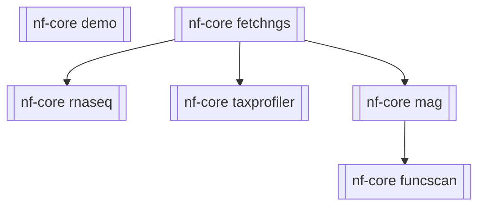

# nf-cascade

A proof of concept daisy-chaining Nextflow workflows.

Implemented cascade:



> [!TIP]
> If you use code from here please acknowledge it by including a comment
> in your code with the url to the code you've used/adapted.

## Description

The aim of this repository is to demonstrate one method of integrating multiple
nextflow workflows together in master workflow. You can then not only integrate existing
workflows, but add on additional analyses. The approach taken here is to run 
nextflow as a child process on the same node as the parent nextflow process.
This is handled by the `NEXTFLOW_RUN` process. The hard part is connecting together
the outputs and inputs. For example, you may need to turn a set of sequence files
into a samplesheet. This means you would need to write your own process to handle
this. This workflow already demonstrates one way of extracting specific files from
a workflow output, that you can use as an input channel to the next process/workflow.

> [!TIP]
> If you're calling an nf-core workflow using this method, don't forget to use
> `nf-core launch` to write the pipeline `params.yml` which can be passed to
> `<workflow>.params_file`.

## Usage

Run nf-core/demo:
```bash
nextflow run main.nf
```

Run nf-core/fetchngs -> ( nf-core/taxprofiler, nf-core/mag -> nf-core/funcscan ):
```bash
nextflow run main.nf -params-file params.yml
```

> [!NOTE]
> Parameter files can be supplied for each workflow though the `<workflow>.params_file` config.
> `<workflow>.input` can be set to supply a samplesheet, or override the samplesheet provided by
> a previous workflow (`<workflow>.input` and previous workflow stages take precedence over 
> samplesheets provided through `<workflow>.params_file`).

## Pros and cons

Pros:

- Easy-ish to implement ( copy module, link with channels ).
- No messing with code of pipeline you're trying to integrate.

Cons:

- If a pipeline fails, you need to wait for any concurrent pipelines to finish.
- Less control over modules and channels integrated. It's the whole pipeline included ( you maybe able to configure running portions ).

## Backstory

Being able to chain workflows together has often been requested, in nf-core, and elsewhere. 
One solution is to run the workflows separately. There have also been various attempts at 
combining workflows in the past, such as [my attempt](https://github.com/mahesh-panchal/test_nfcore_workflow_chain) 
a few years ago. At the time, my attempt was not feasible as there was too much maintenance 
overhead resulting from modifying template code (which has since changed dramatically).

A chance question in [Nextflow slack](https://nextflow.slack.com/archives/C02T98A23U7/p1720687369824409) 
about how could one run their own Nextflow pipeline in a benchmarking workflow, led to the
solution here. I proposed that one could run `nextflow` in a native process
(i.e., using `exec:`). Native processes are written in Groovy, and run on the same node
as the parent `nextflow` command. This means they also have access to the same environment
meaning `nextflow` executed in a native process could also submit to job schedulers and
use different packaging platforms. One downside is that native processes also execute
from the launch directory, rather than the work directory. After a bit of googling, I 
discovered the `ProcessBuilder` class, which could run a command in another directory. Initially
I thought about running this in the work directory (`task.workDir`), but realised any
failures would start the whole child nextflow workflow from the beginning again in a new work directory. 
However, since we can write to any directory, I decided to make a separate folder in 
the work directory in which the workflows could resume, writing only the results the task 
specific directory (which is also handy for clean up). Native processes also don't stage 
files, and so must be referred to using their uri strings (by using `val` instead of `path` 
on `Path` types), which makes handling input files easier. Resuming a workflow is then left 
to the child `nextflow` process.

## Acknowledgements

Special thanks to [James Fellows Yates](https://github.com/jfy133) for finding a small 
dataset that runs from fetchngs through to funcscan (frankly, the hardest part). And a 
big thank you to the nf-core and Nextflow community for all their questions and discussions.
 